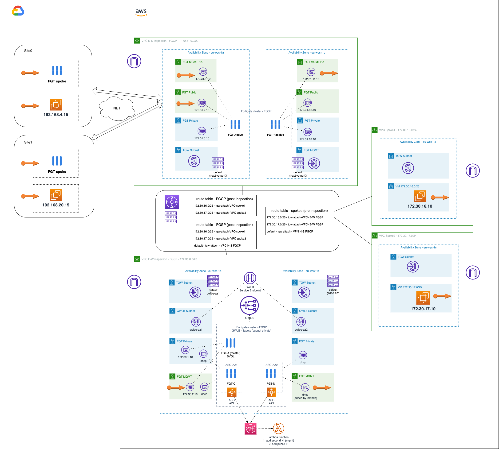

# AWS Transit Gateway for N-S traffic inspection and E-W AWS GWLB for E-W traffic with autoscaling
## Introduction
This project gives an example of a scenario using [AWS Transit Gateway](https://aws.amazon.com/transit-gateway/) product to route traffic to two VPC inspections with Fortigate cluster. Firtsly, one VPC with a Fortigate active-passive cluster will inspect N-S traffic to Internet and SD-WAN sites connected to it. Sencondly, another VPC will inspect E-W traffic between VPC attached to TGW. 

## Requirements
* [Terraform](https://learn.hashicorp.com/terraform/getting-started/install.html) >= 1.0.0
- Terraform Provider hashicorp/random v3.4.3
- Terraform Provider hashicorp/template v2.2.0
- Terraform Provider hashicorp/archive v2.2.0
- Terraform Provider hashicorp/http v3.2.1
- Terraform Provider hashicorp/aws v4.39.0
- Terraform Provider hashicorp/local v2.2.3
- Terraform Provider hashicorp/tls v4.0.4

## Deployment overview 

* Step 1. Go to AWS-deployment folder to deploy in AWS
* Step 2. Go to GCP-site to deploy as many sites as needed in GCP (this step is optional if you want to try our SD-WAN solution and how it integrates with the complete architecture)

## Diagram solution

Full diagram solution with sites deployed in GCP


## Deployment
* Clone the repository.
* Change ACCESS_KEY and SECRET_KEY values in terraform.tfvars.example.  And rename `terraform.tfvars.example` to `terraform.tfvars`.
* Change parameters in the variables.tf.
* If using SSO, uncomment the token variable in variables.tf and providers.tf
* Initialize the providers and modules:
  ```sh
  $ terraform init
  ```
* Submit the Terraform plan:
  ```sh
  $ terraform plan
  ```
* Verify output.
* Confirm and apply the plan:
  ```sh
  $ terraform apply
  ```
* If output is satisfactory, type `yes`.


## Destroy the instance
To destroy the instance, use the command:
```sh
$ terraform destroy
```

# Support
This a personal repository with goal of testing and demo Fortinet solutions on the Cloud. No support is provided and must be used by your own responsability. Cloud Providers will charge for this deployments, please take it in count before proceed.

## License
Based on Fortinet repositories with original [License](https://github.com/fortinet/fortigate-terraform-deploy/blob/master/LICENSE) © Fortinet Technologies. All rights reserved.

