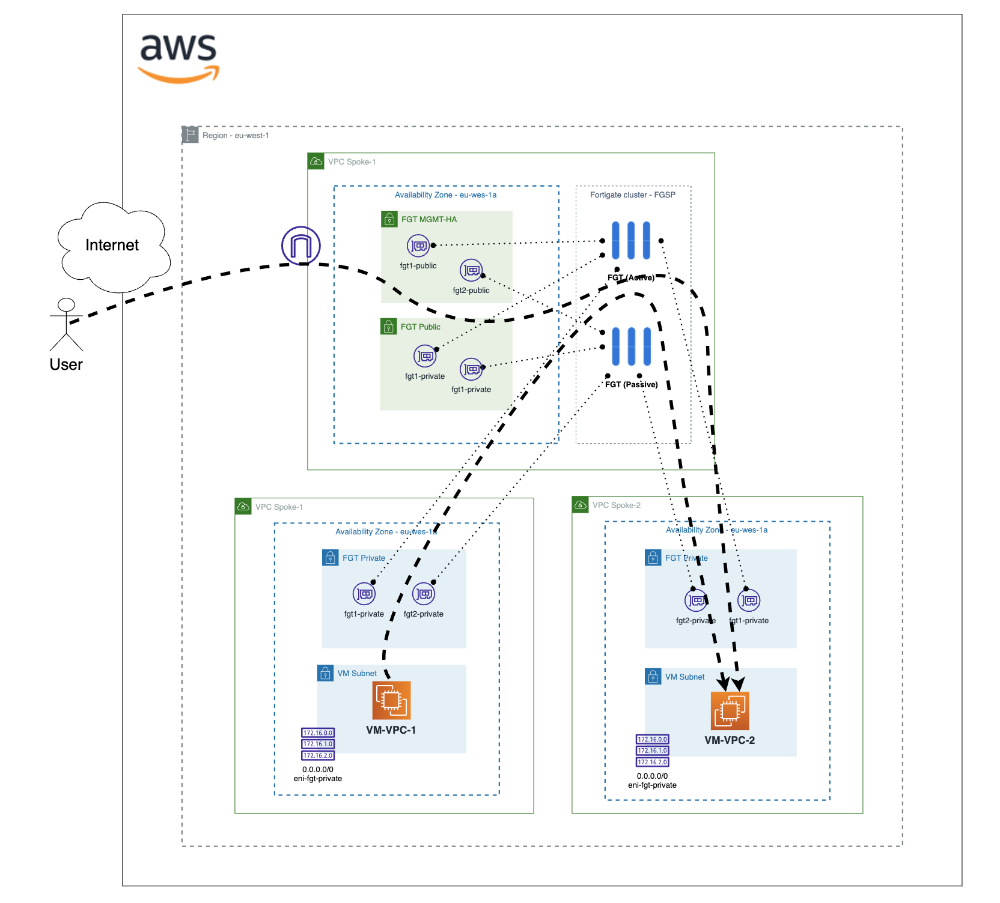

# Forigate cluster deployment multi-vpc ENI
## Introduction

This deployment will create a Fortigate Cluster Active/Passive in one Availabitly Zone (AZ) with and ENI in another VPC. This use case cover the need to interconnect two VPC through a firewall. 

## Deployment Overview

- VPC 1 with subnets: Management (MGMT), Public, Private, Bastion. (Main VPC of fortigate cluster)
- VPC 2 with subnet: Private and Bastion.
- Fortigate cluster: 2 instances with 4 insterfaces each one and 2 EIP for management associated to MGMT interface and 1 EIP associated to active public interface. Another interface will be placed in VPC 2 (port4)
- 2 x Bastion linux instances in each VPC.

## Diagram overview

## Requirements
* [Terraform](https://learn.hashicorp.com/terraform/getting-started/install.html) >= 1.0.0
* Check particulars requiriments for each deployment (AWS) 

## Deployment
* Clone the repository.
* Configure accesss secrets to access AWS in terraform.tfvars.example which is allocated in root folder. [terraform.tfvars.example](./terraform.tfvars.example).  And rename `terraform.tfvars.example` to `terraform.tfvars`.
* Change parameters in the variables.tf.
* If using SSO, uncomment the token variable in variables.tf and providers.tf
* Initialize the providers and modules in each individual deployment as is described in it README file.

# Support
This a personal repository with goal of testing and demo Fortinet solutions on the Cloud. No support is provided and must be used by your own responsability. Cloud Providers will charge for this deployments, please take it in count before proceed.

## License
[License](./LICENSE)

