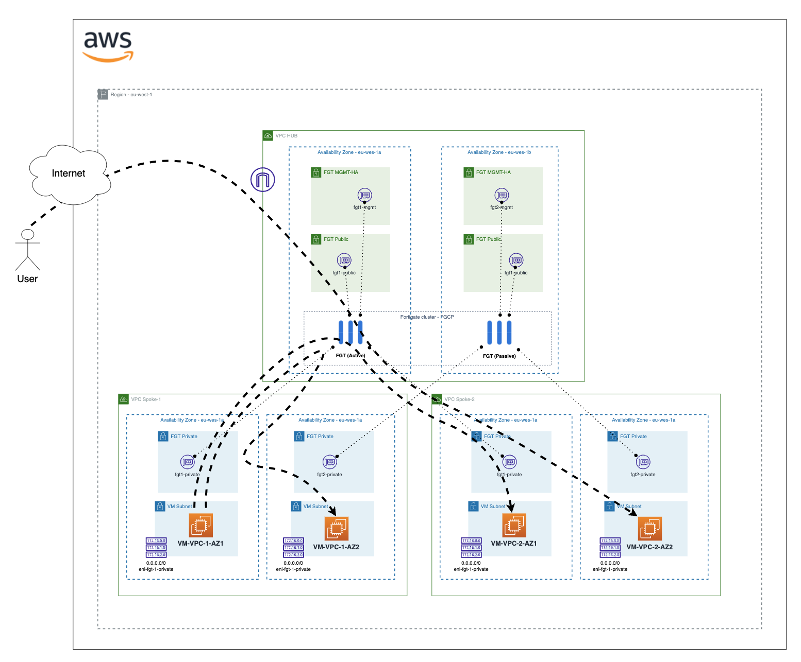
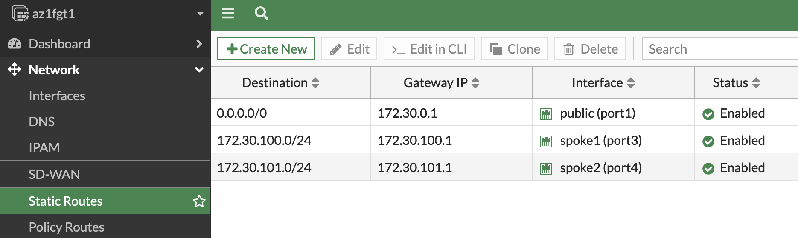
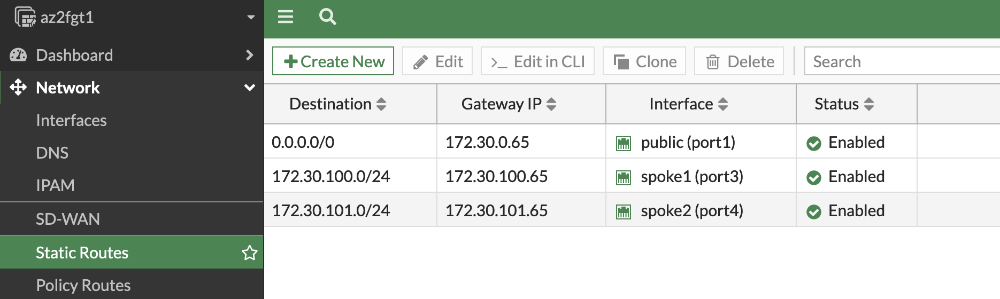
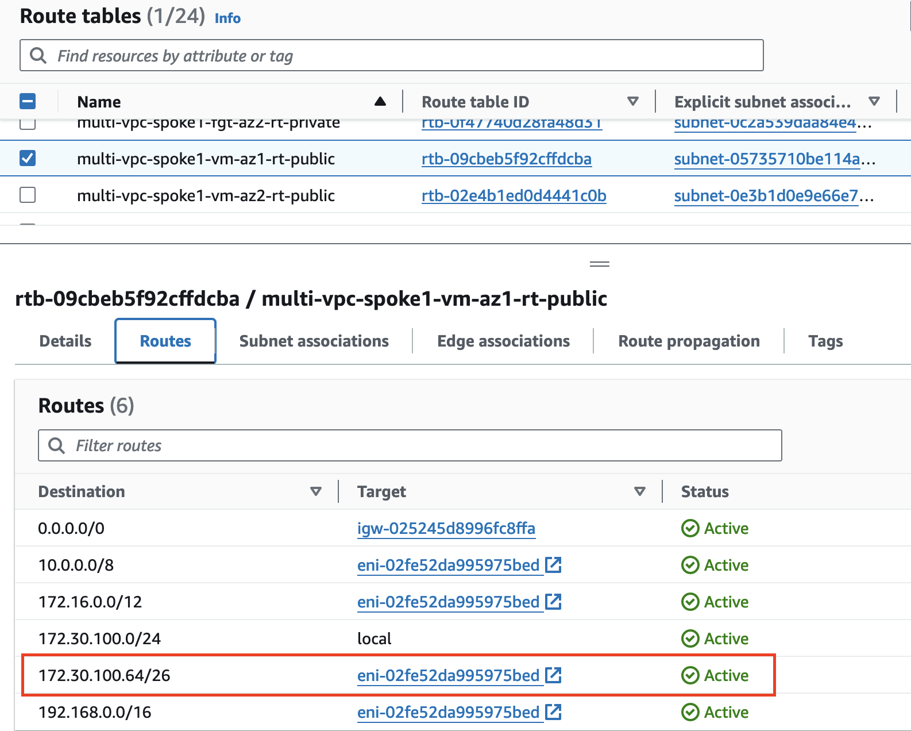
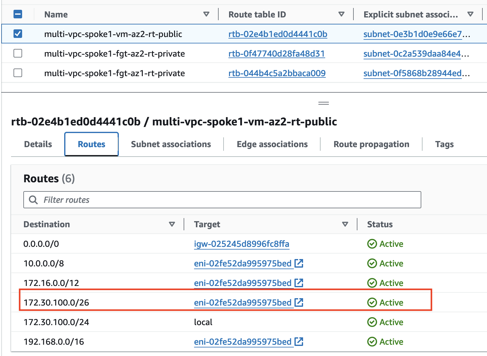

# Forigate cluster deployment multi-vpc ENI

This deployment will create a Fortigate Cluster Active/Passive in one or two Availabitly Zone (AZ) with ENIs in different VPCs than principal. The topology follows a VPC HUB and SPOKE schema, where fortigate cluster has an ENI in each SPOKE VPC. 

The traffic will flow between spoke VPCs through the fortigate cluster using the fortigate ENI in each VPC as next hop in subnet route tables, allowing visibility and inspection. 

## Diagram overview

- 1AZ deployment:


- 2AZ deployment:


## Deployment Overview

- One VPC with subnets: Management (MGMT), Public, HUB VPC of fortigate cluster.
- Spokes VPCs with subnets: "fgt" used for fortigate ENIs and "vm" for deploy a test linux machine. 
- Fortigate cluster: 2 instances with 2 interface in HUB VPC (Public and Management) and one interface en each VPC spokes. 
- Linux test instances in each VPC and in each AZ configured.
- Configure variables for deployment editing file **"0_UPDATE-locals.tf"**

```
prefix = "multi-vpc"
region = "eu-west-1"
azs    = ["eu-west-1a", "eu-west-1b"] // configure 1 or 2 AZs

instance_type = "c6i.xlarge"  // 4 interfaces supported
fgt_build     = "build1577"   // v7.2.7
license_type  = "payg"        // or "byol"

fgt_vpc_cidr = "172.30.0.0/24" // Fortigates VPC cidr

spoke_vpc_number = 2 // Maximum 2 if you are using c6i.xlarge

```

(You can leave the rest of local variables as configured)

- After deployment, it is neccesary to add a static route for each VPC spoke.

- Fortigate 1:


```sh
config router static
    edit 1
        set gateway 172.30.0.1
        set device "port1"
    next
    edit 2
        set dst 172.30.100.0 255.255.255.0
        set gateway 172.30.100.129
        set device "port3"
    next
    edit 3
        set dst 172.30.101.0 255.255.255.0
        set gateway 172.30.101.129
        set device "port4"
    next
end
```

- Fortigate 2:


```sh
config router static
    edit 1
        set gateway 172.30.0.65
        set device "port1"
    next
    edit 2
        set dst 172.30.100.0 255.255.255.0
        set gateway 172.30.100.193
        set device "port3"
    next
    edit 3
        set dst 172.30.101.0 255.255.255.0
        set gateway 172.30.101.193
        set device "port4"
    next
end
```

(If you are deploying in 2 AZ, static routes are different, not in case of 1AZ)

- If you want to control traffic intra-VPC, subnet to subnet, you can add a specific route in each subnet route table pointing to other subnet CIDR to the Fortigate ENI.

How to do it in this deployment: 

- SPOKE VPC1 subnet VM AZ1 -> CIDR 172.30.100.0/26
- SPOKE VPC1 subnet VM AZ2 -> CIRD 172.30.100.64/26
- Route Table applied to subnet SPOKE VPC1 VM-AZ1:



- Route Table applied to subnet SPOKE VPC1 VM-AZ2:



Now the traffic between subnets goes through the Fortigate.

## Requirements
* [Terraform](https://learn.hashicorp.com/terraform/getting-started/install.html) >= 1.0.0
* Check particulars requiriments for each deployment (AWS) 

## Deployment
* Clone the repository.
* Configure accesss secrets to access AWS in terraform.tfvars.example which is allocated in root folder. [terraform.tfvars.example](./terraform.tfvars.example).  And rename `terraform.tfvars.example` to `terraform.tfvars`.
* Change parameters in the variables.tf.
* If using SSO, uncomment the token variable in variables.tf and providers.tf
* Initialize the providers and modules in each individual deployment as is described in it README file.

# Support
This a personal repository with goal of testing and demo Fortinet solutions on the Cloud. No support is provided and must be used by your own responsability. Cloud Providers will charge for this deployments, please take it in count before proceed.

## License
[License](./LICENSE)

