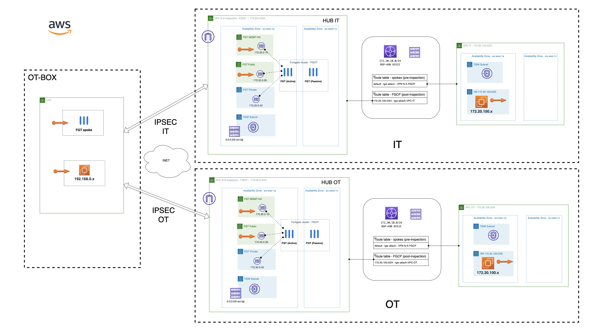

# Forigate SDWAN HUB and SPOKE deployment
## Introduction

This deployment will create two HUBs in Active/Passive mode in two Availabitly Zone (AZ) acting as HUBs, and also other site acting as spoke of both HUBs.

## Deployment Overview

- HUB IT: FortiGate cluster A-P within a VPC attached to a TGW with 2 route tables, one for post-inspecction associated to FortiGate VPC and other pre-inspection associated to VPC IT.
- HUB OT: FortiGate cluster A-P within a VPC attached to a TGW with 2 route tables, one for post-inspecction associated to FortiGate VPC and other pre-inspection associated to VPC OT
- SITE OT-BOX: a standalone FortiGate, pre configured to create a FGSP cluster and SDWAN config to connect to both HUBs.
- Linux test virtual machine in HUBs and SITE for testing connectivity.

## Diagram overview

- Full diagram

## Requirements
* [Terraform](https://learn.hashicorp.com/terraform/getting-started/install.html) >= 1.0.0
* Check particulars requiriments for each deployment (AWS) 

## Deployment
* Clone the repository.
* Configure accesss secrets to access AWS in terraform.tfvars.example which is allocated in root folder. [fgt-ha-1az_onramp](https://github.com/jmvigueras/modules/tree/main/aws/examples/fgt-ha-1az_onramp).  And rename `terraform.tfvars.example` to `terraform.tfvars`.
* Change parameters in the variables.tf.
* If using SSO, uncomment the token variable in variables.tf and providers.tf
* Initialize the providers and modules in each individual deployment as is described in it README file.

# Support
This a personal repository with goal of testing and demo Fortinet solutions on the Cloud. No support is provided and must be used by your own responsability. Cloud Providers will charge for this deployments, please take it in count before proceed.

## License
Based on Fortinet repositories with original [License](https://github.com/fortinet/fortigate-terraform-deploy/blob/master/LICENSE) © Fortinet Technologies. All rights reserved.

