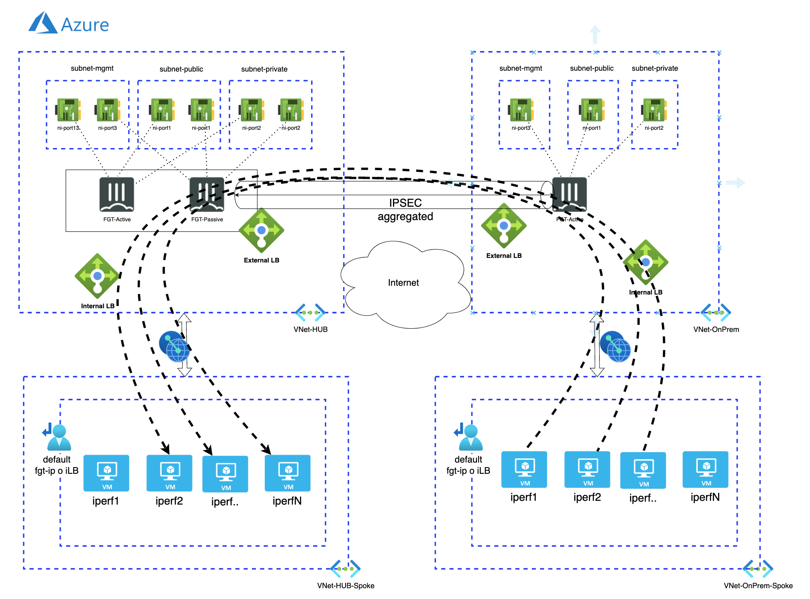

# Azure site to site deployment connection between two cluster
## Introduction

This code will create two FortiGate clusters that connect to each other through Internet using an aggregated IPsec tunnel. Additionally, Linux VM machines are deployed for testing the performance of the connection between the two clusters. The iperf connections are automated to perform tests between the two sites upon startup. The number of IPsec tunnels and the number of Linux VMs can be configured as local variables in the code.

## Diagram overview

## Requirements
* [Terraform](https://learn.hashicorp.com/terraform/getting-started/install.html) >= 1.0.0
* Check particulars requiriments for each deployment (Azure) 

## Deployment
* Clone the repository.
* Configure accesss secrets to access Azure terraform.tfvars.example and rename `terraform.tfvars.example` to `terraform.tfvars`.
* Change parameters in the variables.tf.
* If using SSO, uncomment the token variable in variables.tf and providers.tf
* Initialize the providers and modules in each individual deployment as is described in it README file.

# Support
This a personal repository with goal of testing and demo Fortinet solutions on the Cloud. No support is provided and must be used by your own responsability. Cloud Providers will charge for this deployments, please take it in count before proceed.

## License
Based on Fortinet repositories with original [License](https://github.com/fortinet/fortigate-terraform-deploy/blob/master/LICENSE) © Fortinet Technologies. All rights reserved.

