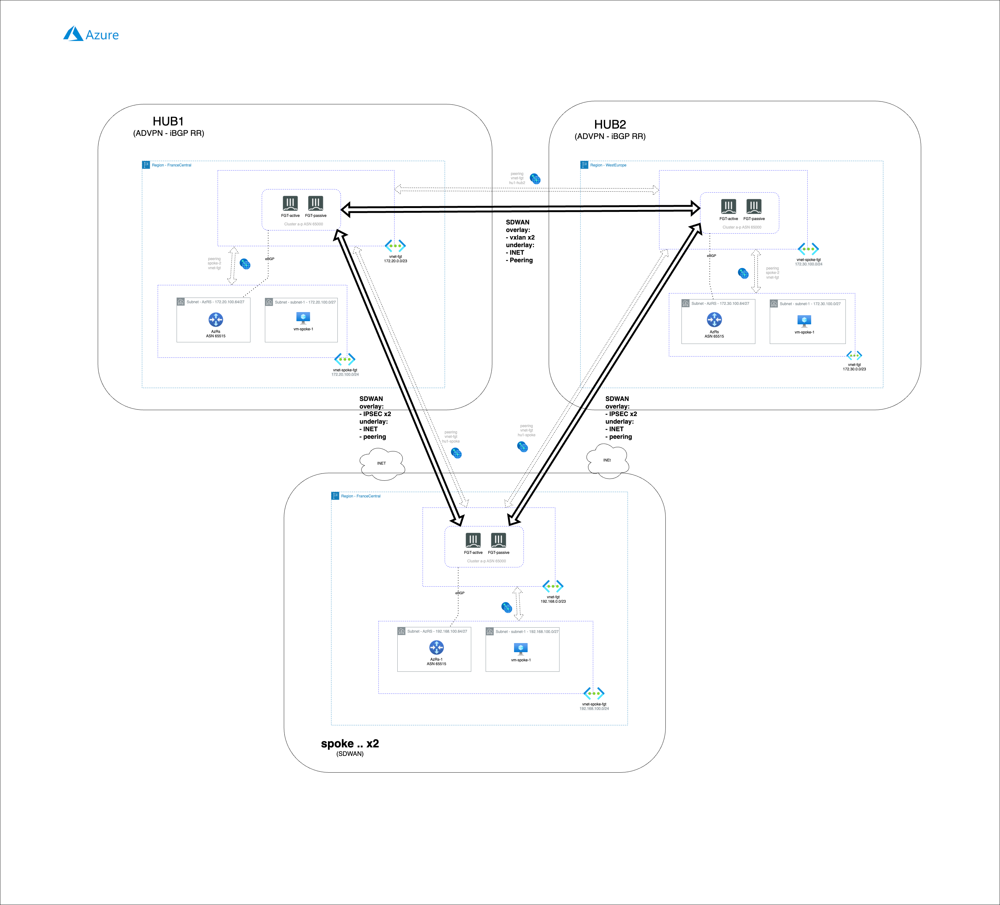
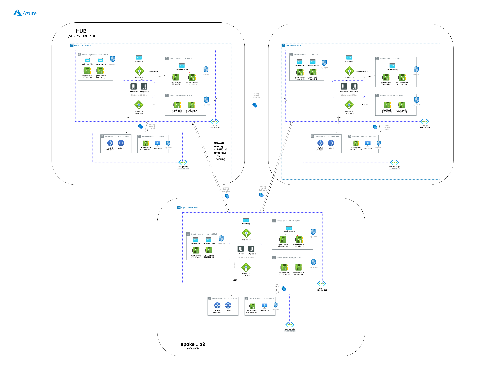

# Multi HUB and multi region SDWAN ADVPN scenario with 2 HUBs deployed in Azure and 2 spokes
## Introduction

This deployment will create a full multi HUB and multi Region scenario, with 2 HUBs deployed in FranceCentral and WestEurope and 2 spokes deployed in FranceCentral. The traffic between HUBs and site is managed by fortigate using SDWAN technology and traffic inside HUBs is also controled by fortigates clusters. With this configuration all traffic will be inspected and controlled using fortigate L7 inspection improving security and visibility. 

(Private connection between hubs and between hub and spoke, is provided by Azure vNet peering, using Azure core Network. Also, Internet is used and aditional underlay to create necessary overlays)

## Requirements
* [Terraform](https://learn.hashicorp.com/terraform/getting-started/install.html) >= 1.0.0
* Check particulars requiriments for each deployment (Azure) 

## Deployment Overview

- Full deployment of a multi HUB enviroment with 2 hubs and 2 site/spokes.
- Fortigate HUBs vNets are peered to provide private connection between clusters. 
- Fortigate HUBs vNets and Fortigate spoke are peered to to provide private connection between spoke and hubs.
- HUBs are connected using a simulated point to point L3 connection with an vxlan interface over Internet and over peerings.
- Sites created two different ADVPN with Hubs where iBGP is used for dynamic routing. 
- Overlays are deployed over private connection using Azure core network and Internet.

## Diagram overview

## Diagram detailed

## Deployment
* Clone the repository.
* Configure accesss secrets to access AWS, Azure and GCP in each terraform.tfvars.example which is allocated in folders of following deploment: [HubAWS](https://github.com/jmvigueras/playground/tree/main/demo_multi-cloud_sdwan_L400/aws_fgt-ha-2az_hub_tgw), [HubAzure](https://github.com/jmvigueras/playground/tree/main/demo_multi-cloud_sdwan_L400/az_fgt-ha_hub_xlb-vwan) and [SiteGCP](https://github.com/jmvigueras/playground/tree/main/demo_multi-cloud_sdwan_L400/gcp_fgt-ha_spoke).  And rename `terraform.tfvars.example` to `terraform.tfvars`.
* Change parameters in the variables.tf.
* If using SSO, uncomment the token variable in variables.tf and providers.tf
* Initialize the providers and modules in each individual deployment as is described in it README file.

# Support
This a personal repository with goal of testing and demo Fortinet solutions on the Cloud. No support is provided and must be used by your own responsability. Cloud Providers will charge for this deployments, please take it in count before proceed.

## License
Based on Fortinet repositories with original [License](https://github.com/fortinet/fortigate-terraform-deploy/blob/master/LICENSE) © Fortinet Technologies. All rights reserved.

