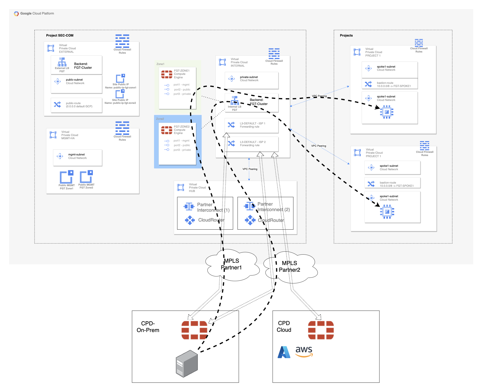

# Forigate cluster deployment in GCP with two Cloud Interconnect providers (simulated)
## Introduction

This deployment will create a Fortigate Cluster Active/Active with a private VPC peering with other VPC in a HUB and SPOKE topology and connection with an on premisses cluster

## Diagram overview

## Deployment
* Clone the repository.
* Configure accesss secrets to access AWS in terraform.tfvars.example which is allocated in root folder. [fgt-ha-1az_onramp](https://github.com/jmvigueras/modules/tree/main/aws/examples/fgt-ha-1az_onramp).  And rename `terraform.tfvars.example` to `terraform.tfvars`.
* Change parameters in the variables.tf.
* If using SSO, uncomment the token variable in variables.tf and providers.tf
* Initialize the providers and modules in each individual deployment as is described in it README file.

# Support
This a personal repository with goal of testing and demo Fortinet solutions on the Cloud. No support is provided and must be used by your own responsability. Cloud Providers will charge for this deployments, please take it in count before proceed.
