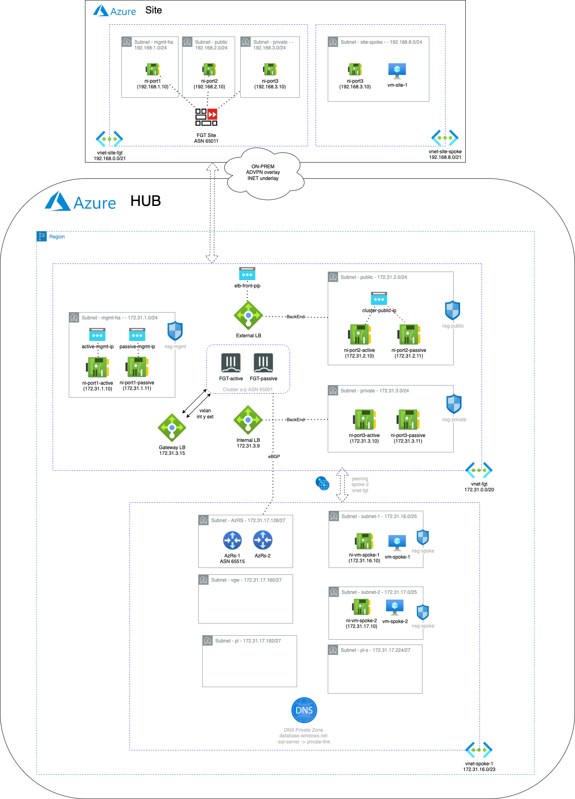

# Fortigate cluster HUB, site, VNET spokes and vHUB deployment on the Azure with Terraform
## Introduction

This is a full example of an IaC deployment of a common HUB and SPOKE topology, with a Fortigate cluster in a inspection VNET acting as SDWAN HUB and connected to VNET spokes through peering.

## Requirements
* [Terraform](https://learn.hashicorp.com/terraform/getting-started/install.html) >= 0.12.0
* Terraform Provider AzureRM >= 2.24.0
* Terraform Provider Template >= 2.2.0
* Terraform Provider Random >= 3.1.0

## Deployment overview
Terraform deploys the following components:
   - Update vars.tf with CIDR blocks for VNET fortigate. 
   - In this deployment those modules have been used as inputs:
      - module vnet-fgt (`github.com/jmvigueras/modules//azure/vnet-fgt`)
      - module vnet-spoke (`github.com/jmvigueras/modules//azure/vnet-spoke`)
      - module site-spoke-to-2hubs (`github.com/jmvigueras/modules//azure/site-spoke-to-2hubs`)
      - module xlb-fgt (`github.com/jmvigueras/modules/azure//xlb-fgt`)
      - module rs (`github.com/jmvigueras/modules//azure/rs`)

## Deployment diagram



## Deployment considerations:
   - Create file terraform.tfvars using terraform.tfvars.example as template 
   - Update variables in var.tf with fortigate cluster deployment
   - You will be charged for this deployment

## Deployment
To deploy the FortiGate-VM to Azure:
1. Create module with source `source = "github.com/jmvigueras/modules/azure/vnet-spoke`
2. Customize variables in the `terraform.tfvars.example` and `vars.tf` file as needed.  And rename `terraform.tfvars.example` to `terraform.tfvars`.
3. Initialize the providers and modules:
   ```sh
   $ cd XXXXX
   $ terraform init
    ```
4. Submit the Terraform plan:
   ```sh
   $ terraform plan
   ```
5. Verify output.
6. Confirm and apply the plan:
   ```sh
   $ terraform apply
   ```
7. If output is satisfactory, type `yes`.

Output will include the information necessary:
```sh
Outputs:

<Detail info of VNETs and Subnet deployed>
```

## Destroy the deployment
To destroy the instance, use the command:
```sh
$ terraform destroy
```

# Support
This a personal repository with goal of testing and demo Fortinet solutions on the Cloud. No support is provided and must be used by your own responsability. Cloud Providers will charge for this deployments, please take it in count before proceed.

## License
Based on Fortinet repositories with original [License](https://github.com/fortinet/fortigate-terraform-deploy/blob/master/LICENSE) © Fortinet Technologies. All rights reserved.

