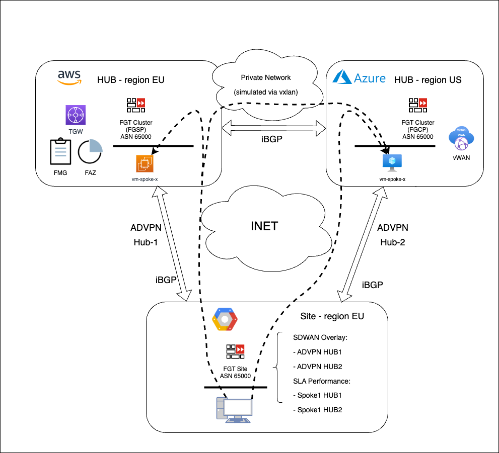
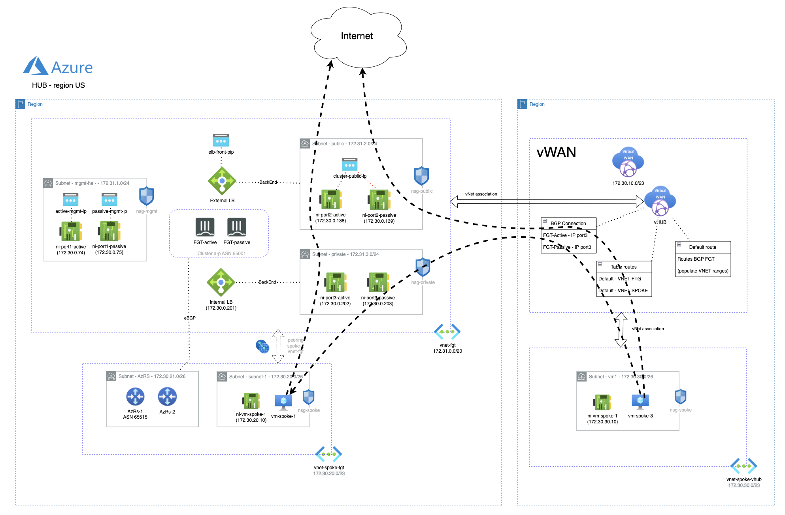
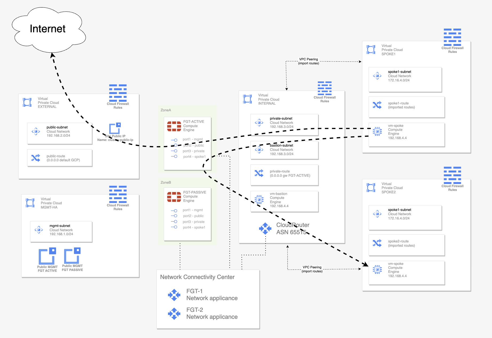

# Multi HUB SDWAN ADVPN scenario with 2 HUB deployed in AWS and Azure and 1 site in GCP
## Introduction

This deployment will create a full multi HUB and Spoke scenario with 2 HUBs and 1 site. The traffic between HUBs and site is managed by fortigate using SDWAN technology and traffic inside HUBs is also controled by fortigates clusters. With this configuration all traffic will be inspected and controlled using fortigate L7 inspection improving security and visibility. 

## Deployment Overview

- Full deployment of a multi HUB enviroment with 2 hubs and 1 site. 
- HUB 1 is deployed in AWS with advanced routing integrated with TGW.
- HUB 2 is deployed in Azure with advanced routing integrated with vWAN.
- Site is deployed in GCP with advanced routing integrated with Network Connectivity Center (NCC).
- HUBs are connected using a simulated point to point L3 connection with an vxlan interface over Internet. 
- Sites created two different ADVPN with Hubs where iBGP is used for dynamic routing. 
- Fortigate configuration of HUB 1 deployment needs to be updated with public IP of HUB 2 for configuring vxlan interface. For this a Postman collection can be used that can be found in AWS deployment part.

## Diagram solution

### HubAWS diagram

### HubAazure diagram

### SiteGCP diagram

## Deployment
* Clone the repository.
* Configure accesss secrets to access AWS, Azure and GCP in each terraform.tfvars.example which is allocated in folders of following deploment: [HubAWS](https://github.com/jmvigueras/playground/tree/main/demo_multi-cloud_sdwan_L400/aws_fgt-ha-2az_hub_tgw), [HubAzure](https://github.com/jmvigueras/playground/tree/main/demo_multi-cloud_sdwan_L400/az_fgt-ha_hub_xlb-vwan) and [SiteGCP](https://github.com/jmvigueras/playground/tree/main/demo_multi-cloud_sdwan_L400/gcp_fgt-ha_spoke).  And rename `terraform.tfvars.example` to `terraform.tfvars`.
* Change parameters in the variables.tf.
* If using SSO, uncomment the token variable in variables.tf and providers.tf
* Initialize the providers and modules in each individual deployment as is described in it README file.

## Requirements
* [Terraform](https://learn.hashicorp.com/terraform/getting-started/install.html) >= 1.0.0
* Check particulars requiriments for each deployment (AWS, Azure and GCP) 

# Support
This a personal repository with goal of testing and demo Fortinet solutions on the Cloud. No support is provided and must be used by your own responsability. Cloud Providers will charge for this deployments, please take it in count before proceed.

## License
Based on Fortinet repositories with original [License](https://github.com/fortinet/fortigate-terraform-deploy/blob/master/LICENSE) © Fortinet Technologies. All rights reserved.

